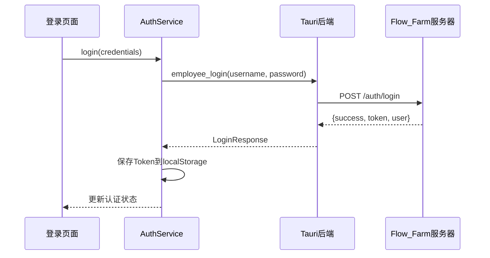
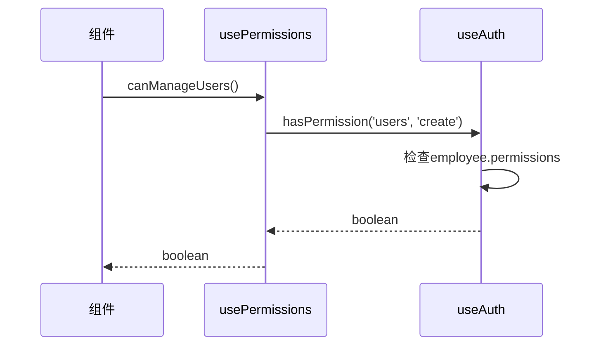

# 员工GUI登录模块设计文档

## 📋 概述

本文档详细说明了员工GUI桌面程序的登录模块设计，该模块通过Flow_Farm管理服务器进行员工认证。

## 🏗️ 架构设计

### 整体架构
```
员工GUI桌面程序 (Tauri + React)
        ↓ HTTP请求
Flow_Farm管理服务器 (Rust + Axum)
        ↓ 数据库查询
SQLite数据库 (用户信息)
```

### 认证流程
```
1. 员工输入用户名和密码
2. 前端调用AuthService.login()
3. AuthService通过Tauri调用Rust后端
4. Rust后端发送HTTP请求到Flow_Farm服务器
5. Flow_Farm服务器验证凭据并返回JWT Token
6. 前端保存Token和用户信息到localStorage
7. 后续请求都携带Token进行认证
```

## 🔧 核心组件

### 1. AuthService (TypeScript)
**文件**: `src/services/authService.ts`

**功能**:
- 处理登录、登出、Token验证
- 与Tauri后端通信
- 用户信息映射和管理

**主要方法**:
- `login(credentials)` - 员工登录
- `logout(token)` - 员工登出
- `verifyToken(token)` - 验证Token有效性
- `getCurrentUser(token)` - 获取当前用户信息
- `changePassword(token, oldPwd, newPwd)` - 修改密码

### 2. Auth Service (Rust)
**文件**: `src-tauri/src/services/auth_service.rs`

**功能**:
- Tauri命令处理
- HTTP客户端请求管理
- 与Flow_Farm服务器通信

**主要命令**:
- `employee_login` - 处理登录请求
- `verify_token` - 验证Token
- `get_current_user` - 获取用户信息
- `employee_logout` - 处理登出
- `refresh_token` - 刷新Token
- `change_password` - 修改密码

### 3. useAuth Hook
**文件**: `src/hooks/useAuth.ts`

**功能**:
- React状态管理
- 认证状态维护
- 提供认证相关方法

**状态管理**:
```typescript
interface AuthState {
  isAuthenticated: boolean;
  isLoading: boolean;
  employee?: Employee;
  token?: string;
  error?: string;
}
```

### 4. AuthGuard 组件
**文件**: `src/components/auth/AuthGuard.tsx`

**功能**:
- 路由守护
- 自动检查认证状态
- 未认证时显示登录页面

### 5. LoginPage 组件
**文件**: `src/pages/auth/LoginPage.tsx`

**功能**:
- 登录界面
- 用户名/密码输入
- 记住登录状态
- 错误信息显示

## 🔐 安全特性

### Token管理
- 使用JWT Token进行认证
- Token存储在localStorage (可选记住登录)
- 自动Token过期检查
- Token刷新机制

### 权限系统
- 基于角色的权限控制 (RBAC)
- 细粒度权限检查
- usePermissions Hook提供权限查询

### 安全措施
- HTTPS通信 (生产环境)
- 密码强度验证
- 登录失败保护
- 会话超时管理

## 📊 数据流程

### 登录流程


### 权限检查流程


## 🛠️ 配置说明

### 服务器配置
**文件**: `src/config/auth.ts`

```typescript
const AUTH_CONFIG = {
  SERVER_BASE_URL: 'http://localhost:8000/api',  // Flow_Farm服务器地址
  API_TIMEOUT: 10000,                            // 请求超时时间
  TOKEN_REFRESH_THRESHOLD: 5 * 60 * 1000,        // Token刷新阈值
  AUTO_LOGOUT_AFTER: 24 * 60 * 60 * 1000,       // 自动登出时间
};
```

### 环境变量
- `NODE_ENV` - 环境标识 (development/production)
- Flow_Farm服务器需要在对应端口运行

## 🚀 部署步骤

### 1. 启动Flow_Farm服务器
```bash
cd D:/repositories/Flow_Farm/server-backend
cargo run
# 服务器将在 http://localhost:8000 运行
```

### 2. 配置员工GUI
确保 `src/services/authService.ts` 中的服务器地址正确:
```typescript
private static readonly SERVER_BASE_URL = 'http://localhost:8000/api';
```

### 3. 构建和运行
```bash
cd D:/repositories/employeeGUI
npm install
npm run tauri dev  # 开发环境
npm run tauri build # 生产构建
```

## 🔍 测试流程

### 1. 登录测试
- 使用Flow_Farm中的测试用户登录
- 验证Token保存和状态更新
- 测试"记住我"功能

### 2. 权限测试
- 不同角色用户登录
- 验证权限控制是否正确
- 测试权限检查Hook

### 3. 错误处理测试
- 网络断开情况
- 服务器错误响应
- Token过期处理

## 📝 使用示例

### 组件中使用认证
```typescript
import { useAuth, usePermissions } from './hooks';

const MyComponent = () => {
  const { employee, logout } = useAuth();
  const { canManageUsers, isAdmin } = usePermissions();
  
  return (
    <div>
      <h1>欢迎, {employee?.displayName}</h1>
      {canManageUsers() && <UserManagementPanel />}
      {isAdmin() && <AdminPanel />}
      <button onClick={logout}>退出登录</button>
    </div>
  );
};
```

### 手动认证检查
```typescript
import AuthService from './services/authService';

const checkAuth = async () => {
  const token = localStorage.getItem('authToken');
  if (token) {
    const isValid = await AuthService.verifyToken(token);
    if (!isValid) {
      // 清除无效Token
      localStorage.removeItem('authToken');
      localStorage.removeItem('employee');
    }
  }
};
```

## 🔧 故障排除

### 常见问题

1. **登录失败**: 
   - 检查Flow_Farm服务器是否运行
   - 确认服务器地址配置正确
   - 检查用户凭据是否有效

2. **Token验证失败**:
   - 检查Token是否过期
   - 确认服务器端Token验证逻辑

3. **权限检查错误**:
   - 验证用户角色和权限配置
   - 检查权限映射逻辑

4. **网络连接问题**:
   - 检查防火墙设置
   - 确认CORS配置 (开发环境)

### 调试工具
- 浏览器开发者工具查看网络请求
- Tauri开发者工具查看Rust日志
- localStorage查看存储的认证信息

## 📈 未来扩展

1. **多因素认证 (MFA)**
2. **单点登录 (SSO)**
3. **生物识别登录**
4. **更细粒度的权限控制**
5. **审计日志记录**
6. **密码策略管理**

这个登录模块提供了完整的认证和授权功能，确保员工GUI应用的安全性和用户体验。
