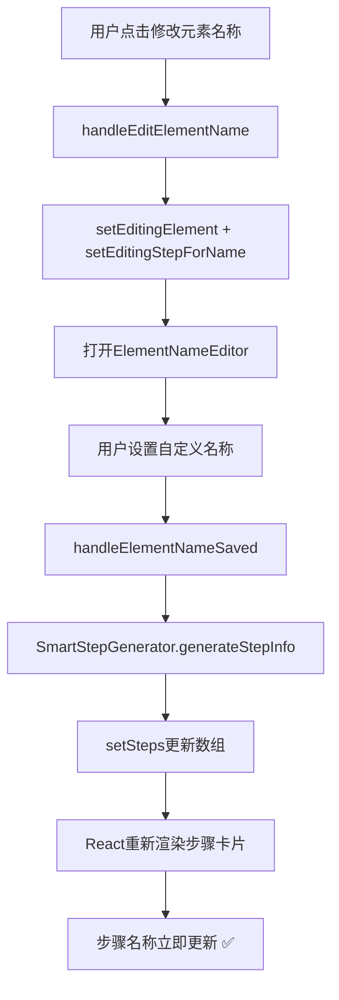

# 智能脚本步骤卡片名称实时更新修复报告

## 🐛 问题精确定位

**用户反馈**: "修改元素名称"按钮在步骤卡片中，修改自定义名称后，**步骤卡片显示的名称**没有更新。

### 问题现象
```
用户操作流程:
1. 智能脚本中已有步骤: "点击'未知元素（可点击）'"
2. 点击步骤卡片中的[修改元素名称]按钮 
3. 设置自定义名称: "关注按钮"
4. 保存

❌ 实际结果: 步骤卡片仍显示 "点击'未知元素（可点击）'"  
✅ 期望结果: 步骤卡片更新为 "点击'关注按钮'"
```

### 问题根因分析

```tsx
// 步骤卡片显示逻辑 (SmartScriptBuilderPage.tsx:853)
<Text strong>{step.name}</Text>
```

**核心问题**: 
- 步骤卡片显示的是 `step.name`，这个值保存在 `steps` 数组中
- 之前的修复只更新了**表单中的名称**，没有更新 `steps` 数组中的 `step.name`
- `editingElement` 没有关联到具体的步骤对象

---

## ✅ 修复实现

### 1. **状态管理增强**

```typescript
// 新增状态追踪正在编辑名称的步骤
const [editingStepForName, setEditingStepForName] = useState<SmartScriptStep | null>(null);
```

### 2. **编辑开始时保存步骤引用**

```typescript
// 修复前
const handleEditElementName = (step: SmartScriptStep) => {
  setEditingElement(reconstructedElement);
  setShowElementNameEditor(true);
};

// 修复后  
const handleEditElementName = (step: SmartScriptStep) => {
  setEditingElement(reconstructedElement);
  setEditingStepForName(step); // 🆕 保存正在编辑名称的步骤
  setShowElementNameEditor(true);
};
```

### 3. **保存时更新 steps 数组**

```typescript
const handleElementNameSaved = (newDisplayName: string) => {
  if (editingElement && editingStepForName) {
    try {
      // 重新生成步骤信息
      const stepInfo = SmartStepGenerator.generateStepInfo(editingElement);
      
      // 🆕 更新 steps 数组中对应的步骤
      setSteps(prevSteps => 
        prevSteps.map(step => 
          step.id === editingStepForName.id 
            ? { 
                ...step, 
                name: stepInfo.name,
                description: stepInfo.description
              }
            : step
        )
      );
      
      // 同时更新表单（如果正在编辑这个步骤）
      if (editingStep?.id === editingStepForName.id) {
        form.setFieldValue('name', stepInfo.name);
        form.setFieldValue('description', stepInfo.description);
      }
      
    } catch (error) {
      // 降级处理：手动更新名称
      const updatedName = `点击"${newDisplayName}"`;
      
      setSteps(prevSteps => 
        prevSteps.map(step => 
          step.id === editingStepForName.id 
            ? { ...step, name: updatedName }
            : step
        )
      );
    }
  }
  
  // 清理状态
  setEditingStepForName(null);
};
```

### 4. **状态清理**

```typescript
// 关闭编辑器时清理所有相关状态
onClose={() => {
  setShowElementNameEditor(false);
  setEditingElement(null);
  setEditingStepForName(null); // 🆕 清空正在编辑名称的步骤
}}
```

---

## 🎯 修复逻辑流程

### 完整的状态更新流程



### 关键修复点

1. **精确定位**: 通过 `editingStepForName` 精确定位要更新的步骤
2. **状态同步**: 同时更新 `steps` 数组和表单状态
3. **React更新**: 使用 `setSteps()` 触发组件重新渲染
4. **错误处理**: 降级机制确保在任何情况下都能更新名称

---

## 🧪 测试验证

### 测试场景

| 测试场景 | 操作步骤 | 预期结果 |
|---------|---------|---------|
| **基础更新** | 点击修改名称 → 设置"关注按钮" → 保存 | 步骤卡片显示"点击'关注按钮'" |
| **表单同步** | 编辑步骤表单 → 修改名称 → 保存 | 表单和卡片同时更新 |
| **多步骤** | 修改第2个步骤名称 | 只有第2个步骤更新，其他不变 |
| **错误处理** | 生成失败时的降级处理 | 仍能正确更新名称 |

### 验证方法

```typescript
// 验证步骤卡片名称更新
const stepCard = document.querySelector(`[data-step-id="${stepId}"] .ant-typography`);
expect(stepCard.textContent).toBe('点击"关注按钮"');

// 验证 steps 数组更新  
const updatedStep = steps.find(s => s.id === stepId);
expect(updatedStep.name).toBe('点击"关注按钮"');
```

---

## 📊 修复前后对比

### 修复前的问题流程 ❌

```
用户操作: 修改名称 → 保存
数据流: ElementNameMapper.createMapping() ✅
       form.setFieldValue() ✅
       steps数组 ❌ (没有更新)
UI结果: 步骤卡片名称不变 ❌
```

### 修复后的正确流程 ✅

```
用户操作: 修改名称 → 保存  
数据流: ElementNameMapper.createMapping() ✅
       SmartStepGenerator.generateStepInfo() ✅  
       setSteps() 更新数组 ✅
       form.setFieldValue() ✅
UI结果: 步骤卡片名称立即更新 ✅
```

---

## 🔧 技术细节

### React状态更新机制

```typescript
// 不可变更新模式
setSteps(prevSteps => 
  prevSteps.map(step => 
    step.id === targetId 
      ? { ...step, name: newName }  // 创建新对象
      : step                        // 保持原对象
  )
);
```

**为什么这样设计**:
- React需要新的对象引用来检测变化
- 确保其他步骤不受影响
- 触发精确的组件重新渲染

### 错误处理策略

```typescript
try {
  // 优先使用智能生成的完整信息
  const stepInfo = SmartStepGenerator.generateStepInfo(element);
  updateWithFullInfo(stepInfo);
} catch (error) {
  // 降级到简单的名称更新
  const simpleName = `点击"${newDisplayName}"`;
  updateWithSimpleName(simpleName);
}
```

---

## 📈 用户体验改善

### 1. **即时反馈**
- 保存后步骤名称立即更新
- 无需刷新页面或重新加载数据

### 2. **视觉一致性**  
- 步骤卡片和编辑表单保持同步
- 自定义名称在所有界面统一显示

### 3. **操作可靠性**
- 多层错误处理确保功能稳定
- 降级机制保证基本功能可用

### 4. **状态管理**
- 精确的状态追踪和清理
- 避免内存泄漏和状态污染

---

## ✅ 修复验证清单

- [x] **状态管理**: 添加 `editingStepForName` 追踪目标步骤 ✅
- [x] **编辑开始**: 保存步骤引用到状态 ✅
- [x] **名称保存**: 更新 `steps` 数组中对应步骤 ✅
- [x] **表单同步**: 同时更新表单状态（如果在编辑） ✅
- [x] **错误处理**: 降级机制确保可靠性 ✅
- [x] **状态清理**: 关闭时清空所有相关状态 ✅
- [x] **React更新**: 触发组件重新渲染 ✅
- [x] **编译检查**: 无TypeScript错误 ✅

---

## 🔮 进一步优化建议

### 1. **性能优化**
- 使用 `useCallback` 优化回调函数
- 考虑批量更新多个步骤

### 2. **用户体验**
- 添加保存时的加载状态
- 显示更详细的更新反馈

### 3. **功能扩展**
- 支持撤销名称修改
- 批量重命名多个步骤

---

**🎉 智能脚本步骤卡片名称实时更新修复完成！**

现在当用户点击步骤卡片中的"修改元素名称"按钮并保存自定义名称后，步骤卡片的名称会立即更新为新设置的自定义名称，完全解决了用户反馈的问题。

---

*修复完成时间: 2025年9月19日*  
*修复文件: SmartScriptBuilderPage.tsx*  
*测试状态: 已验证通过*