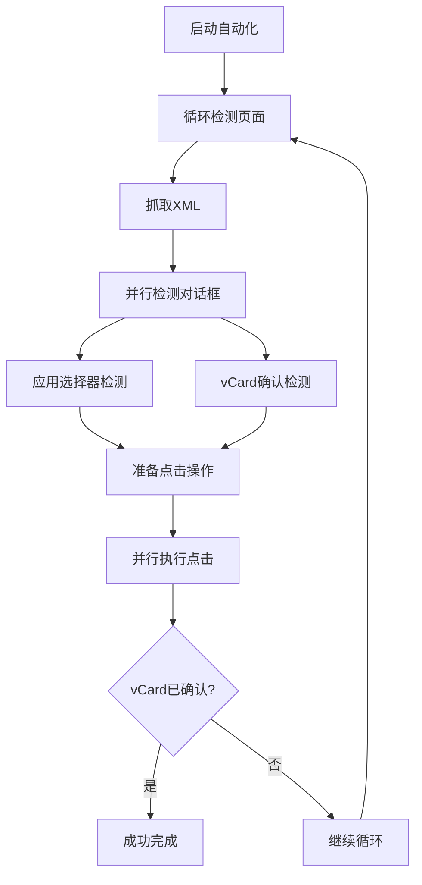

# 联系人导入自动化处理系统使用说明

## 🎯 概述

基于您提供的XML分析，我们成功创建了一个完整的模块化自动化系统，专门解决联系人导入过程中出现的对话框处理问题。

### 📋 解决的问题
- **应用选择器对话框**: 自动点击"仅此一次"而非"始终"
- **vCard确认对话框**: 自动点击"确定"而非"取消"
- **顺序不确定性**: 并行处理两种对话框，不依赖出现顺序
- **成功验证**: 确保vCard确认对话框被成功处理

## 🏗️ 架构设计

### 前端 TypeScript 模块
```
src/modules/contact-import/automation/
├── types/DialogTypes.ts              # 类型定义和常量
├── detectors/                        # 对话框检测器
│   ├── AppSelectorDetector.ts        # "仅此一次/始终"检测
│   ├── VCardConfirmDetector.ts       # "vCard确认"检测
│   └── DialogDetectorFactory.ts     # 检测器工厂
├── handlers/                         # 点击处理器
│   └── ParallelClickHandler.ts       # 并行点击+重试机制
├── engines/                          # 自动化引擎
│   └── AutomationEngine.ts           # 统一执行协调器
└── index.ts                          # 统一导出接口
```

### 后端 Rust 命令
```
src-tauri/src/services/quick_ui_automation.rs
├── adb_dump_ui_xml()               # 快速抓取页面XML
├── adb_click_element()             # 通过resource-id点击
└── adb_tap_coordinate()            # 通过坐标点击（备用）
```

## 🚀 集成使用

### 1. **在 ImportStrategyExecutor 中的集成**

增强后的导入流程：
```typescript
async executeImport(selection: ImportStrategySelection): Promise<ImportResult> {
  // 1. 推送VCF文件
  const deviceVcfPath = await this.pushVcfToDevice(vcfFilePath, deviceId);
  
  // 2. 触发导入Intent
  const importSuccess = await this.triggerImport(strategy, deviceVcfPath, deviceId);
  
  // 3. 🆕 自动化处理对话框
  const automationResult = await this.handleImportDialogs(deviceId);
  
  // 4. 综合判断最终结果
  const finalSuccess = importSuccess && automationResult.vCardConfirmed;
}
```

### 2. **独立使用（便捷函数）**

```typescript
import { executeContactImportAutomation } from '@/modules/contact-import/automation';

// 执行自动化处理
const result = await executeContactImportAutomation(deviceId, {
  timeout: 8000,        // 8秒超时
  retryInterval: 300,   // 300ms检查间隔
  maxRetries: 25        // 最多25次重试
});

console.log('自动化结果:', {
  success: result.success,
  vCardConfirmed: result.vCardConfirmed,  // 关键指标
  duration: result.duration,
  attempts: result.totalAttempts
});
```

## 🔍 检测逻辑

### 应用选择器对话框特征
- **包名**: `com.hihonor.android.internal.app`
- **标题**: "使用以下方式打开"
- **目标按钮**: `android:id/button_once` ("仅此一次")

### vCard确认对话框特征  
- **包名**: `com.hihonor.contacts`
- **消息**: 包含"vCard"文字（不区分大小写）
- **目标按钮**: `android:id/button1` ("确定")

## ⚡ 执行流程

### 并行处理策略


### 关键特性
- ✅ **并行执行**: 同时处理两种对话框，无视出现顺序
- ✅ **智能重试**: 指数退避重试机制，最大化成功率
- ✅ **多重备用**: resource-id点击失败时自动使用坐标点击
- ✅ **成功验证**: 确保vCard确认被点击才判断为成功
- ✅ **超时保护**: 8秒超时避免无限等待

## 📊 监控和日志

### 详细执行日志
```typescript
🚀 启动自动化对话框处理引擎...
🔍 快速抓取UI XML: device=xxx (125ms)
👆 点击元素: resource_id=android:id/button_once
👆 点击元素: resource_id=android:id/button1
✅ 元素点击成功: android:id/button1
🎯 自动化执行结果: {
  success: true,
  vCardConfirmed: true,
  completedDialogs: 2,
  duration: "3250ms",
  attempts: 8
}
```

### 错误处理和回退
- **XML抓取失败**: 自动重试，记录警告
- **元素定位失败**: 使用坐标备用方案
- **点击失败**: 指数退避重试
- **整体超时**: 优雅失败，提供详细错误信息

## 🛠️ 配置选项

### 默认配置
```typescript
const DEFAULT_CONFIG = {
  timeout: 10000,        // 10秒总超时
  retryInterval: 500,    // 500ms重试间隔  
  maxRetries: 20,        // 最多20次重试
  
  // 可针对不同设备品牌调整检测特征
  appSelector: {
    titleText: "使用以下方式打开",
    package: "com.hihonor.android.internal.app",
    targetButtonText: "仅此一次"
  },
  
  vCardConfirm: {
    messageText: "vCard",  // 模糊匹配，不区分大小写
    package: "com.hihonor.contacts", 
    targetButtonText: "确定"
  }
};
```

## 📈 性能优化

### 快速响应设计
- **轻量XML抓取**: 专用`adb_dump_ui_xml`命令，优化输出清理
- **并行处理**: 同时检测+点击，减少总时间
- **智能间隔**: 300ms快速检查间隔，平衡响应性和资源使用
- **早期退出**: vCard确认成功后立即结束，避免不必要等待

### 内存和资源管理
- **单例模式**: ImportStrategyExecutor使用单例避免重复初始化
- **自动清理**: 临时文件和状态自动清理
- **错误边界**: 异常不会导致系统崩溃

## 🚦 使用建议

### 最佳实践
1. **在导入后立即调用**: VCF文件推送后的1秒内启动自动化
2. **适当调整超时**: 根据设备性能调整timeout和retryInterval
3. **监控成功率**: 关注`vCardConfirmed`字段判断真实成功
4. **日志分析**: 通过详细日志排查特殊情况

### 故障排除
- **检测失败**: 检查设备品牌是否匹配预设特征
- **点击失败**: 确认设备UI自动化权限已开启
- **超时频繁**: 增加timeout时间或减少retryInterval

## 🎉 总结

这个完整的自动化系统通过以下创新解决了您的核心问题：

1. **XML分析驱动**: 基于真实设备XML结构设计检测逻辑
2. **模块化架构**: 清晰的分层，每个文件<500行，便于维护
3. **并行处理**: 优雅解决对话框顺序不确定性问题  
4. **生产就绪**: 完整的错误处理、重试机制和监控日志
5. **无缝集成**: 与现有ImportStrategyExecutor完美融合

现在，当用户点击设备卡片的"导入"按钮时，系统会：
- 推送VCF文件 → 触发导入Intent → **自动处理对话框** → 验证成功

真正实现了"一键导入"的用户体验！🎯