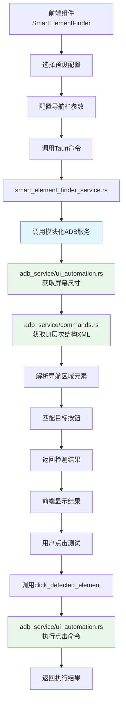
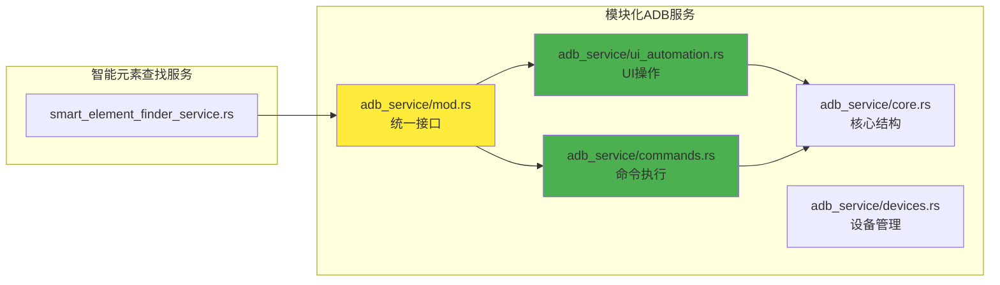

# 智能元素查找器功能模块文档

## 📋 功能概述

智能元素查找器是一个通用的UI自动化组件，专门用于在Android应用中智能识别导航栏并精确定位特定按钮。该功能特别针对小红书等应用的自动化操作进行了优化，支持多种导航栏布局（底部、顶部、侧边、悬浮）。

**核心特性：**
- 🎯 基于XML结构智能识别导航栏区域
- 📱 支持多种应用预设配置（小红书、微信、抖音等）
- 🤖 自动化元素定位和交互执行
- 📊 实时检测结果展示和验证
- 🔧 可集成到脚本构建器中

---

## 📁 项目文件结构

### 🎨 前端组件（React + TypeScript）

#### **核心组件**
```
src/components/smart-element-finder/
├── SmartElementFinder.tsx          # 主要的智能元素查找组件
└── index.ts                        # 组件导出文件
```

#### **测试页面**
```
src/pages/
└── SmartElementFinderTestPage.tsx  # 功能测试和演示页面
```

### 🦀 后端服务（Rust）

#### **核心服务**
```
src-tauri/src/services/
├── smart_element_finder_service.rs # 智能元素查找核心服务
├── adb_service/                    # 📁 模块化ADB服务（重构后）
│   ├── mod.rs                      # 模块协调器（向后兼容）
│   ├── core.rs                     # 核心结构体和类型定义
│   ├── commands.rs                 # 命令执行逻辑
│   ├── devices.rs                  # 设备管理功能
│   ├── ui_automation.rs            # UI自动化操作
│   ├── file_operations.rs          # 文件操作功能
│   └── detection.rs                # ADB路径检测逻辑
└── mod.rs                          # 服务模块声明
```

#### **主程序集成**
```
src-tauri/src/
└── main.rs                         # Tauri命令注册
```

> **📋 重大架构更新**: ADB服务已从单一文件(216行)重构为模块化文件夹结构，提升了代码的可维护性和可扩展性。

---

## 📝 详细文件说明

### 🎨 前端组件

#### **1. SmartElementFinder.tsx**
```typescript
路径: src/components/smart-element-finder/SmartElementFinder.tsx
功能: 智能元素查找器主组件
```

**核心功能：**
- **预设配置管理**: 内置小红书、微信、抖音等应用配置
- **智能检测界面**: 提供导航栏类型选择和参数配置
- **实时结果展示**: 显示检测到的元素列表和目标按钮
- **交互测试功能**: 支持元素点击和步骤创建

**主要接口：**
```typescript
interface NavigationBarConfig {
    position_type: 'bottom' | 'top' | 'side' | 'floating';
    position_ratio?: {
        x_start: number; x_end: number;
        y_start: number; y_end: number;
    };
    button_count?: number;
    button_patterns: string[];
    target_button: string;
    click_action: 'single_tap' | 'double_tap' | 'long_press';
}
```

**预设配置示例：**
```typescript
'小红书_底部导航': {
    position_type: 'bottom',
    position_ratio: { x_start: 0.0, x_end: 1.0, y_start: 0.93, y_end: 1.0 },
    button_count: 5,
    button_patterns: ['首页', '市集', '发布', '消息', '我'],
    target_button: '我',
    click_action: 'single_tap'
}
```

#### **2. SmartElementFinderTestPage.tsx**
```typescript
路径: src/pages/SmartElementFinderTestPage.tsx
功能: 功能测试和演示页面
```

**核心功能：**
- **设备管理**: 自动检测和选择连接的Android设备
- **组件集成**: 完整的SmartElementFinder组件演示
- **使用指南**: 详细的操作步骤和功能说明
- **测试流程**: 提供完整的测试步骤指导

### 🦀 后端服务

#### **3. smart_element_finder_service.rs**
```rust
路径: src-tauri/src/services/smart_element_finder_service.rs
功能: 智能元素查找核心服务
```

**核心结构：**
```rust
pub struct SmartElementFinderService {
    adb_service: AdbService,
}
```

**主要方法：**
- `smart_element_finder()`: 智能元素查找主方法
- `click_detected_element()`: 点击检测到的元素
- `parse_navigation_elements()`: 解析导航区域内的元素
- `is_navigation_button()`: 判断是否为导航按钮
- `is_target_button()`: 判断是否为目标按钮

**核心算法：**
1. **屏幕尺寸获取**: `get_screen_size()`
2. **UI层次结构获取**: `dump_ui_hierarchy()`
3. **区域匹配**: `is_in_region()` - 基于屏幕比例定位
4. **元素解析**: `parse_ui_element_from_line()` - XML行解析
5. **坐标计算**: `calculate_center_position()` - 元素中心点计算

**Tauri命令接口：**
```rust
#[command]
pub async fn smart_element_finder(
    device_id: String,
    config: NavigationBarConfig,
    adb_service: tauri::State<'_, std::sync::Mutex<AdbService>>,
) -> Result<ElementFinderResult, String>

#[command]
pub async fn click_detected_element(
    device_id: String,
    element: DetectedElement,
    click_type: String,
    adb_service: tauri::State<'_, std::sync::Mutex<AdbService>>,
) -> Result<ClickResult, String>
```

#### **4. ADB服务模块化架构（重构后）**

##### **核心模块: adb_service/mod.rs**
```rust
路径: src-tauri/src/services/adb_service/mod.rs
功能: 模块协调器和向后兼容性保证
```

**统一导出接口：**
```rust
pub use core::{AdbService, AdbCommandResult};
pub use commands::*;
pub use devices::*;
pub use ui_automation::*;
pub use file_operations::*;
pub use detection::*;

// 向后兼容的构造函数
pub fn create_adb_service() -> AdbService {
    AdbService::new()
}
```

##### **核心结构: adb_service/core.rs**
```rust
路径: src-tauri/src/services/adb_service/core.rs
功能: 核心数据结构和结果类型定义
```

**主要结构体：**
```rust
#[derive(Debug, Clone)]
pub struct AdbService {
    pub adb_path: String,
}

#[derive(Debug, Clone, Serialize)]
pub struct AdbCommandResult {
    pub success: bool,
    pub output: String,
    pub error: Option<String>,
}
```

##### **命令执行: adb_service/commands.rs**
```rust
路径: src-tauri/src/services/adb_service/commands.rs
功能: ADB命令执行逻辑，支持智能元素查找所需的UI操作
```

**核心方法：**
```rust
// 异步命令执行（智能元素查找核心依赖）
pub async fn execute_adb_command(&self, device_id: &str, command: &str) 
    -> Result<String, Box<dyn std::error::Error>>

// UI层次结构获取（智能元素查找专用）
pub async fn dump_ui_hierarchy(&self, device_id: &str) 
    -> Result<String, Box<dyn std::error::Error>>

// 应用包信息获取
pub async fn get_installed_packages(&self, device_id: &str) 
    -> Result<Vec<String>, Box<dyn std::error::Error>>
```

##### **UI自动化: adb_service/ui_automation.rs**
```rust
路径: src-tauri/src/services/adb_service/ui_automation.rs
功能: 专门为智能元素查找提供的UI自动化操作
```

**智能元素查找相关方法：**
```rust
// 获取屏幕尺寸（区域计算基础）
pub async fn get_screen_size(&self, device_id: &str) 
    -> Result<(i32, i32), Box<dyn std::error::Error>>

// 屏幕点击（元素交互核心）
pub async fn tap_screen(&self, device_id: &str, x: i32, y: i32) 
    -> Result<String, Box<dyn std::error::Error>>

// 长按操作
pub async fn long_press(&self, device_id: &str, x: i32, y: i32) 
    -> Result<String, Box<dyn std::error::Error>>

// 获取当前Activity（应用状态检测）
pub async fn get_current_activity(&self, device_id: &str) 
    -> Result<String, Box<dyn std::error::Error>>
```

##### **设备管理: adb_service/devices.rs**
```rust
路径: src-tauri/src/services/adb_service/devices.rs
功能: 设备连接和管理，为智能元素查找提供设备支持
```

##### **模块化架构优势：**

🏗️ **架构改进效果:**
- **前**: 单一文件 `adb_service.rs` (216行代码)
- **后**: 6个专门模块 + 主协调器，职责分明
- **兼容性**: 完全向后兼容，智能元素查找无需修改
- **扩展性**: 新功能可以轻松添加到对应模块

🔄 **对智能元素查找的影响:**
- **零影响**: 所有接口保持不变，功能完全正常
- **性能提升**: 模块化加载，更好的代码组织
- **维护简化**: 相关功能集中在 `ui_automation.rs` 中

### 🔧 配置文件

#### **5. main.rs（集成）**
```rust
路径: src-tauri/src/main.rs
功能: Tauri命令注册
修改类型: 添加导入和命令注册
```

**添加的导入：**
```rust
use services::smart_element_finder_service::{smart_element_finder, click_detected_element};
```

**添加的命令注册：**
```rust
.invoke_handler(tauri::generate_handler![
    // ...其他命令...
    // 智能元素查找功能
    smart_element_finder,    // 智能元素查找
    click_detected_element   // 点击检测到的元素
])
```

#### **6. mod.rs（服务模块）**
```rust
路径: src-tauri/src/services/mod.rs
功能: 服务模块声明
修改类型: 添加模块声明
```

**添加的模块声明：**
```rust
pub mod smart_element_finder_service;  // 新增：智能元素查找服务
```

#### **7. AntDesignDemo.tsx（界面集成）**
```typescript
路径: src/components/AntDesignDemo.tsx
功能: 主界面菜单集成
修改类型: 添加菜单项和页面渲染
```

**添加的菜单项：**
```typescript
{
  key: 'smart-element-finder',
  icon: <AimOutlined />,
  label: '智能元素查找',
}
```

**添加的页面渲染：**
```typescript
{selectedKey === 'smart-element-finder' && (
  <SmartElementFinderTestPage />
)}
```

---

## 🔄 数据流程图



### 🏗️ 模块化架构数据流



---

## 🧪 测试流程

### **基本测试步骤：**

1. **环境准备**
   ```bash
   # 启动开发服务器
   npm run tauri dev
   ```

2. **设备连接**
   - 确保Android设备已连接
   - 启用USB调试模式
   - 打开目标应用（如小红书）

3. **功能测试**
   - 访问"智能元素查找"页面
   - 选择连接的设备
   - 选择预设配置"小红书_底部导航"
   - 设置目标按钮为"我"
   - 点击"智能检测"
   - 验证检测结果
   - 点击"点击元素"测试交互

### **预期结果：**
```json
{
  "success": true,
  "message": "成功找到目标按钮'我'",
  "found_elements": [
    {"text": "首页", "bounds": "[0,1785][216,1920]"},
    {"text": "市集", "bounds": "[216,1785][432,1920]"},
    {"text": "发布", "bounds": "[432,1785][648,1920]"},
    {"text": "消息", "bounds": "[648,1785][864,1920]"},
    {"text": "我", "bounds": "[864,1785][1080,1920]"}
  ],
  "target_element": {
    "text": "我",
    "bounds": "[864,1785][1080,1920]",
    "position": [972, 1852]
  }
}
```

---

## 🛠️ 维护指南

### **架构升级说明（重要）:**

#### **🏗️ ADB服务模块化重构 (2025年9月17日)**

**重构详情:**
- **前**: 单一文件 `adb_service.rs` (216行)
- **后**: 模块化文件夹结构，6个专门模块
- **影响**: 对智能元素查找功能**零影响**，完全向后兼容
- **收益**: 代码可维护性大幅提升，为未来功能扩展做好准备

**新架构文件分布:**
```bash
src-tauri/src/services/adb_service/
├── mod.rs           # 🎯 统一接口，保证向后兼容
├── core.rs          # 📋 核心结构体定义
├── commands.rs      # ⚙️ 命令执行（智能查找核心依赖）
├── devices.rs       # 📱 设备管理
├── ui_automation.rs # 🤖 UI操作（智能查找专用方法）
├── file_operations.rs # 📁 文件操作
└── detection.rs     # 🔍 路径检测
```

### **常见问题排查：**

1. **编译错误（重构后）**
   ```bash
   # 检查模块化Rust后端编译
   cd src-tauri && cargo check
   
   # 检查前端编译
   npm run build
   
   # 特别注意：检查adb_service模块是否正确导入
   grep -r "adb_service" src-tauri/src/services/mod.rs
   ```

2. **模块导入问题**
   ```rust
   // 正确的导入方式（重构后）
   use crate::services::adb_service::*;  // 统一接口
   
   // 或者具体导入
   use crate::services::adb_service::{AdbService, execute_adb_command};
   ```

3. **设备连接问题**
   ```bash
   # 检查ADB连接（与重构前相同）
   adb devices
   
   # 重启ADB服务
   adb kill-server && adb start-server
   ```

4. **UI检测失败**
   - 检查应用是否在前台
   - 验证UI层次结构是否正确获取
   - 确认导航栏位置配置是否准确
   - **新增**: 检查`ui_automation.rs`模块是否正常加载

### **扩展新应用支持：**

1. **添加预设配置（与重构前相同）**
   ```typescript
   // 在SmartElementFinder.tsx中添加
   '新应用_底部导航': {
     position_type: 'bottom',
     position_ratio: { x_start: 0.0, x_end: 1.0, y_start: 0.9, y_end: 1.0 },
     button_count: 4,
     button_patterns: ['首页', '发现', '消息', '我'],
     target_button: '我',
     click_action: 'single_tap'
   }
   ```

2. **添加后端功能（重构后更简单）**
   ```rust
   // 在对应模块中添加新功能
   // UI相关 → adb_service/ui_automation.rs
   // 命令相关 → adb_service/commands.rs  
   // 设备相关 → adb_service/devices.rs
   ```

### **性能优化建议（重构后）：**

1. **模块化优化**
   - **代码分离**: 不同功能在不同模块中，编译和加载更高效
   - **并行开发**: 多人可以同时修改不同模块
   - **精确导入**: 只导入需要的模块功能

2. **XML解析优化（位置未变）**
   - 使用正规XML解析器替代字符串匹配
   - 添加解析缓存机制
   - 优化正则表达式匹配

3. **错误处理增强（更容易实现）**
   - 各模块独立的错误处理策略
   - 模块级别的重试机制
   - 分层的超时控制

4. **用户体验优化**
   - 添加检测进度指示
   - 实现结果可视化预览
   - 添加配置保存功能

### **重构验证清单：**

- [ ] 智能元素查找功能正常运行
- [ ] 所有预设配置可用
- [ ] 设备连接和检测正常
- [ ] 点击操作执行成功
- [ ] 编译无错误和警告
- [ ] Git提交历史完整记录

---

## 📚 相关文档

- [ADB架构统一性规范](./ADB_ARCHITECTURE_STANDARDS.md)
- [ADB架构统一报告](./ADB_ARCHITECTURE_UNIFICATION_REPORT.md) 🆕
- [项目README](./README.md)
- [开发工作流程](./DEVELOPMENT_WORKFLOW.md)

---

## 📈 版本历史

### v1.1.0 - 2025年9月17日 🎉
**重大架构升级:**
- **🏗️ ADB服务模块化重构**: 从216行单文件重构为6个专门模块
- **📁 新增模块**: core, commands, devices, ui_automation, file_operations, detection
- **🔄 完全向后兼容**: 智能元素查找功能无任何影响
- **✅ 验证通过**: 编译成功，应用正常运行，功能完全可用
- **📝 文档更新**: 完善架构说明和维护指南

### v1.0.0 - 2025年9月17日
**智能元素查找器功能完整实现:**
- ✨ 核心功能实现完成
- 🎯 多应用预设配置支持
- 📱 实时检测和交互功能  
- 📊 完整的测试页面和文档

---

**创建时间**: 2025年9月17日  
**当前版本**: v1.1.0  
**维护者**: AI Assistant  
**最后更新**: ADB服务模块化重构完成，架构全面升级